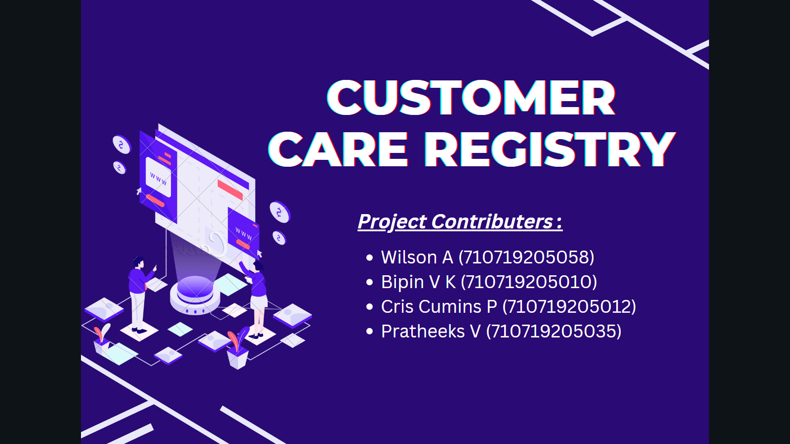

<h1 align="fill" >
 
</h1>

# 🛃 CUSTOMER CARE REGISTRY

- TECHNOLOGY : CLOUD APP DEVELOPMENT
- TEAM ID    : PNT2022TMID31553

# 📒 PROJECT DESCRIPTION

This Application has been developed to help the customer in processing their complaints.  The customers can raise the ticket with a detailed description of the issue.  An Agent will be assigned to the Customer to solve the problem.  Whenever the agent is assigned to a customer they will be notified with an email alert.  Customers can view the status of the ticket till the service is provided.

 ADMIN :
 The main role and responsibility of the admin are to take care of the whole process.  Starting from Admin login followed by the agent creation and assigning the customer's complaints.  Finally, He will be able to track the work assigned to the agent and a notification will be sent to the customer.

 USER :
 They can register for an account.  After the login, they can create the complaint with a description of the problem they are facing.  Each user will be assigned with an agent.  They can view the status of their complaint.

 

 ## PROJECT STATUS - DEVELOPMENT STAGE

 

## 🧑🏻‍🦰 TEAM MEMBERS
- WILSON A
- BIPIN V K   
- CRIS CUMINS P
- PRATHEEKS V

## ASSIGNMENT FINISHED
- [x] ASSIGNMENT 1
- [x] ASSIGNMENT 2
- [x] ASSIGNMENT 3 

## 🔗 LINKS

| TEAM MEMBERS | FOLDER LINK    |
| ------------- | ------------- |
| WILSON A  | <button> <a href="https://github.com/IBM-EPBL/IBM-Project-38964-1660387440/tree/main/Assignments/Team%20lead">CLICK HERE!  </a></button>                 
| BIPIN V K  | <button> <a href="https://github.com/IBM-EPBL/IBM-Project-38964-1660387440/tree/main/Assignments/Team%20Member%202">CLICK HERE!  </a> </button> |
| CRIS CUMINS P     | <button><a href="https://github.com/IBM-EPBL/IBM-Project-38964-1660387440/tree/main/Assignments/Team%20Member%203">CLICK HERE!  </a> </button> |
| PRATHEEKS V     | <button><a href="https://github.com/IBM-EPBL/IBM-Project-38964-1660387440/tree/main/Assignments/Team%20Member%201">CLICK HERE!  </a> </button> |

## PROJECT DESIGN & PLANNING
# 🧩 IDEATION PHASE

      Ideation is the process where you generate ideas and solutions through sessions such as Sketching, Prototyping, Brainstorming, Brainwriting, Worst Possible Idea, and a wealth of other ideation techniques.
- [x] Literature Survey
- [x] Problem Statement
- [x] Empathy Map
- [x] Brainstorm
- [x] Top 3 Ideas

# 🧩 DESIGN PHASE 
      In the design phase, one or more designs are developed, with which the project result can apparently be achieved. Depending on the subject of the project, the products of the design phase can include dioramas, sketches etc

# DESIGN PHASE 01 ⚒️
- [x] Proposed Solution
- [x] Problem-Solution Fit
- [x] Solution Architecture

# DESIGN PHASE 02 ⚒️
- [x] Solution Requirements
- [x] Customer Journey

 <h5> | Dr. N G P Institute of Technology |</h5>

